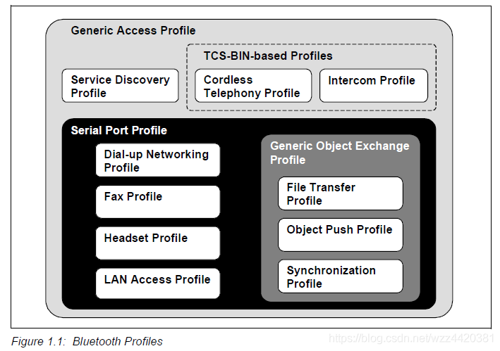

# BtSPPDemo

SPP Server/Client传输示例

## 一、简介

* BREDR: Basic Rate(简称BR),Enhanced Data Rate(简称EDR)  
* 蓝牙协议包括两种技术：Basic Rate(简称BR)和Low Energy(简称LE)  
* Basic Rate是正宗的蓝牙技术，可以包括可选的EDR(Enhanced Data Rate)技术，以及交替使用的MAC(Media Access Control)层和PHY层扩展(简称AMP)  
* BR和EDR是可以同时存在的，但BR/EDR和AMP只能二选一  
* BR/EDR和AMP传输速率的关系为：BR < EDR < AMP（因为AMP借用了WIFI的MAC和物理层）  
* SPP是Serial Port Profile（串口配置文件）的缩写，其定义了使用蓝牙进行RS232（或类似）串行电缆仿真的设备应使用的协议和过程。简单来说就是在蓝牙设备之间建立虚拟的串口进行数据通信
* 从以下的SPP协议与其他协议之间的关系图，可知SPP协议是很多协议的基础协议  

* SPP协议模型如下所示  

* SPP协议需要SDP协议和RFCOMM协议作为支撑，分别负责服务的发现和数据的传输。通常我们将发起SPP连接请求的设备称为Client，接受SPP请求的设备称为Server
* 建立SPP连接的消息流如下所示  

* SPP的UUID：00001101-0000-1000-8000-00805F9B34FB

## 二、Server连接流程

* 检测蓝牙状态

```java
    mBtAdapter = BluetoothAdapter.getDefaultAdapter();

    //若蓝牙未打开，则打开蓝牙
    private void enableBt() {
        if (mBtAdapter == null) {
            Toast.makeText(this, R.string.bluetooth_not_available, Toast.LENGTH_LONG).show();
            return;
        }
        if (!mBtAdapter.isEnabled()) {
            Intent enableIntent = new Intent(BluetoothAdapter.ACTION_REQUEST_ENABLE);
            startActivityForResult(enableIntent, REQUEST_ENABLE_BT);
        } else {
            Toast.makeText(this, R.string.bluetooth_enabled, Toast.LENGTH_SHORT).show();
        }
    }

    protected void onActivityResult(int requestCode, int resultCode, @Nullable Intent data) {
        super.onActivityResult(requestCode, resultCode, data);
        switch (requestCode) {
            case REQUEST_ENABLE_BT:
                if (resultCode == Activity.RESULT_OK) {
                    updateBtStatus(BluetoothAdapter.STATE_ON);
                    updateButtonStatus(true);
                } else {
                    updateBtStatus(BluetoothAdapter.STATE_OFF);
                    updateButtonStatus(false);
                }
                break;
            default:
                break;
        }
    }
```

* Server端开启等待Client端连接线程

```java
    protected void onResume() {
        super.onResume();
        if (mService != null) {
            if (mService.getState() == ServerService.STATE_NONE) {
                mService.start();
            }
        }
    }

    //ServerService.java
    public synchronized void start() {
        if (mConnectedThread != null) {
            Log.e(TAG, "Cancel connected thread");
            mConnectedThread.cancel();
            mConnectedThread = null;
        }

        setState(STATE_LISTEN);
        if (mAcceptThread == null) {
            mAcceptThread = new AcceptThread();
            Log.e(TAG, "Start accept thread");
            acceptThreadRunning = TRUE;
            mAcceptThread.start();
        }
    }

    //mUUID为00001101-0000-1000-8000-00805F9B34FB
    private class AcceptThread extends Thread {
        private BluetoothServerSocket mmServerSocket;

        public AcceptThread() {
            BluetoothServerSocket tmp = null;
            try {
                final boolean secure = PreferenceSettings.getSecurity(mContext);
                if (secure) {
                    tmp = mAdapter.listenUsingRfcommWithServiceRecord(NAME, mUUID);
                } else {
                    tmp = mAdapter.listenUsingInsecureRfcommWithServiceRecord(NAME, mUUID);
                }
            } catch (IOException e) {
                Log.e(TAG, "listen() failed", e);
            }
            mmServerSocket = tmp;
        }

        public void run() {
            Log.e(TAG, "AcceptThread");
            BluetoothSocket socket = null;
            while (acceptThreadRunning) {
                if (mState == STATE_CONNECTED) {
                    try {
                        Thread.sleep(500, 0);
                    } catch (InterruptedException e) {
                        e.printStackTrace();
                    }
                    continue;
                }
                if (mState == STATE_DISCONNECTING) {
                    try {
                        mmServerSocket.close();
                        mmServerSocket = null;
                    } catch (IOException e) {
                        e.printStackTrace();
                    }

                    BluetoothServerSocket tmp = null;
                    try {
                        final boolean secure = PreferenceSettings.getSecurity(mContext);
                        if (secure) {
                            tmp = mAdapter.listenUsingRfcommWithServiceRecord(NAME, mUUID);
                        } else {
                            tmp = mAdapter.listenUsingInsecureRfcommWithServiceRecord(NAME, mUUID);
                        }

                    } catch (IOException e) {
                        Log.e(TAG, "listen() failed", e);
                    }
                    mmServerSocket = tmp;
                    mState = STATE_LISTEN;
                }
                try {
                    socket = mmServerSocket.accept();
                } catch (IOException e) {
                    break;
                }

                if (socket != null) {
                    synchronized (ServerService.this) {
                        switch (mState) {
                            case STATE_LISTEN:
                                Log.e(TAG, "listen");
                            case STATE_CONNECTING:
                                Log.e(TAG, "connecting");
                                connected(socket, socket.getRemoteDevice());
                                break;
                            case STATE_NONE:
                                Log.e(TAG, "state none");
                            case STATE_CONNECTED:
                                Log.e(TAG, "connected");
                                try {
                                    socket.close();
                                } catch (IOException e) {
                                    Log.e(TAG, "Could not close unwanted socket", e);
                                }
                                break;
                            default:
                                Log.e(TAG, "default");
                                break;
                        }
                    }
                }
            }
        }

        public void cancel() {
            try {
                acceptThreadRunning = false;
                mmServerSocket.close();
                mmServerSocket = null;
            } catch (IOException e) {
                Log.e(TAG, "close() of server failed", e);
            }
        }
    }
```

* 设置Server端蓝牙可见，让Client端能搜索到Server端

```java
    private void setBtVisible() {
        if (mBluetoothAdapter.getScanMode() != BluetoothAdapter.SCAN_MODE_CONNECTABLE_DISCOVERABLE) {
            Intent discoverableIntent = new Intent(BluetoothAdapter.ACTION_REQUEST_DISCOVERABLE);
            discoverableIntent.putExtra(BluetoothAdapter.EXTRA_DISCOVERABLE_DURATION, 500);
            startActivity(discoverableIntent);
        } else {
            Toast.makeText(this, "Already discoverable", Toast.LENGTH_SHORT).show();
        }
    }
```

* Server与Client建立连接

```java
    public AcceptThread() {
            BluetoothServerSocket tmp = null;
            try {
                final boolean secure = PreferenceSettings.getSecurity(mContext);
                if (secure) {
                    tmp = mAdapter.listenUsingRfcommWithServiceRecord(NAME, mUUID);
                } else {
                    tmp = mAdapter.listenUsingInsecureRfcommWithServiceRecord(NAME, mUUID);
                }
            } catch (IOException e) {
                Log.e(TAG, "listen() failed", e);
            }
            mmServerSocket = tmp;
    }

    try {
        socket = mmServerSocket.accept();
    } catch (IOException e) {
            break;
    }

    if (socket != null) {
        synchronized (ServerService.this) {
            switch (mState) {
                ......
                case STATE_CONNECTING:
                    Log.e(TAG, "connecting");
                    connected(socket, socket.getRemoteDevice());
                    break;
                ......
            }
        }
    }

    public synchronized void connected(BluetoothSocket socket, BluetoothDevice device) {
        Log.d(TAG, "connected");
        if (mConnectedThread != null) {
            mConnectedThread.cancel();
            mConnectedThread = null;
        }

        mConnectedThread = new ConnectedThread(socket);
        mConnectedThread.start();

        ......
    }

    protected class ConnectedThread extends Thread {
        private final BluetoothSocket mmSocket;
        private final InputStream mmInStream;
        private final OutputStream mmOutStream;
        private boolean mThreadStoping;
        private boolean mThreadStoped;

        public ConnectedThread(BluetoothSocket socket) {
            Log.d(TAG, "create ConnectedThread");
            mmSocket = socket;
            InputStream tmpIn = null;
            OutputStream tmpOut = null;

            try {
                tmpIn = socket.getInputStream();
                tmpOut = socket.getOutputStream();
            } catch (IOException e) {
                Log.e(TAG, "temp sockets not created", e);
            }

            mmInStream = tmpIn;
            mmOutStream = tmpOut;
        }

        public void run() {
            ......
        }

        ......
    }
```

* Server端读写数据  
  * Server端读数据

  ```java
  //ConnectedThread类
  public void run() {
            Log.e(TAG, "BEGIN mConnectedThread");
            byte[] buffer = new byte[1024];
            int bytes = 0;
            while (!mThreadStoping) {
                try {
                    if (mmInStream.available() != 0) {
                        bytes = mmInStream.read(buffer);
                        mHandler.obtainMessage(ConstVar.MESSAGE_READ, bytes, -1, buffer)
                                .sendToTarget();
                    }
                } catch (IOException e) {
                    Log.e(TAG, "disconnected", e);
                    try {
                        mmSocket.close();
                    } catch (IOException e1) {
                        e1.printStackTrace();
                    }
                    connectionLost();
                    break;
                }
            }
            mThreadStoped = true;
  }
  ```

  * Server端写数据

  ```java
  //ConnectedThread类
  /**
   * Write to the connected OutStream.
   *
   * @param buffer The bytes to write
   */
  public void write(byte[] buffer) {
    try {
        mmOutStream.write(buffer);
        Log.e(TAG, "initiative writed:" + buffer.length);
    } catch (IOException e) {
        Log.e(TAG, "Exception during write", e);
    }
  }

  public void sendData(byte[] data) {
    if (mState != STATE_CONNECTED) {
        return;
    }
    write(data);
  }
  ```

## 三、Client连接流程

* 检测蓝牙状态

```java
    mBtAdapter = BluetoothAdapter.getDefaultAdapter();

    //若蓝牙未打开，则打开蓝牙
    private void enableBt() {
        if (mBtAdapter == null) {
            Toast.makeText(this, R.string.bluetooth_not_available, Toast.LENGTH_LONG).show();
            return;
        }
        if (!mBtAdapter.isEnabled()) {
            Intent enableIntent = new Intent(BluetoothAdapter.ACTION_REQUEST_ENABLE);
            startActivityForResult(enableIntent, REQUEST_ENABLE_BT);
        } else {
            Toast.makeText(this, R.string.bluetooth_enabled, Toast.LENGTH_SHORT).show();
        }
    }

    protected void onActivityResult(int requestCode, int resultCode, @Nullable Intent data) {
        super.onActivityResult(requestCode, resultCode, data);
        switch (requestCode) {
            case REQUEST_ENABLE_BT:
                if (resultCode == Activity.RESULT_OK) {
                    updateBtStatus(BluetoothAdapter.STATE_ON);
                    updateButtonStatus(true);
                } else {
                    updateBtStatus(BluetoothAdapter.STATE_OFF);
                    updateButtonStatus(false);
                }
                break;
            default:
                break;
        }
    }
```

* 注册设备搜索广播信息

```java
    //DeviceListActivity.java
    // Register for broadcasts when a device is discovered
    IntentFilter filter = new IntentFilter(BluetoothDevice.ACTION_FOUND);
    // Register for broadcasts when discovery has finished
    filter.addAction(BluetoothAdapter.ACTION_DISCOVERY_FINISHED);
    this.registerReceiver(mReceiver, filter);

    private final BroadcastReceiver mReceiver = new BroadcastReceiver() {
        @Override
        public void onReceive(Context context, Intent intent) {
            String action = intent.getAction();
            // When discovery finds a device
            if (BluetoothDevice.ACTION_FOUND.equals(action)) {
                // Get the BluetoothDevice object from the Intent
                BluetoothDevice device = intent.getParcelableExtra(BluetoothDevice.EXTRA_DEVICE);

                if (mDeviceMacAddressList.contains(device.getAddress())) {
                    return;
                } else {
                    if(device.getType() == BluetoothDevice.DEVICE_TYPE_CLASSIC || device.getType() == BluetoothDevice.DEVICE_TYPE_DUAL) {
                        mDeviceMacAddressList.add(device.getAddress());
                    }
                }
                // If it's already paired, skip it, because it's been listed already
                if (device.getBondState() != BluetoothDevice.BOND_BONDED) {
                    mNewDevicesArrayAdapter.add(device.getName() + "\n" + device.getAddress());
                }
                // When discovery is finished, change the Activity title
            } else if (BluetoothAdapter.ACTION_DISCOVERY_FINISHED.equals(action)) {
                setProgressBarIndeterminateVisibility(false);
                setTitle(R.string.select_device);
                if (mNewDevicesArrayAdapter.getCount() == 0) {
                    String noDevices = getResources().getText(R.string.no_devices_found).toString();
                    mNewDevicesArrayAdapter.add(noDevices);
                }
            }
        }
    };
```

* 使用BlueAdatper搜索

```java
    //DeviceListActivity.java
    private void doDiscovery() {

        ......

        // Request discover from BluetoothAdapter
        mBtAdapter.startDiscovery();
    }
```

* 获取搜索到的蓝牙设备信息  
    在BroadcastReceiver的onReceive()里会获取到搜索到的蓝牙设备信息(如名称，MAC，RSSI)，并通过listview显示出来，再选中你需要连接的蓝牙即可  
* 通过蓝牙设备的MAC地址来建立一个BluetoothDevice对象

```java
    //BtClientActivity.java
    try {
        BluetoothDevice device = mBluetoothAdapter.getRemoteDevice(mMacAddress);
        ......
    } catch (IllegalArgumentException e) {
        e.printStackTrace();
    }
```

* 由BluetoothDevice衍生BluetoothSocket,通过BluetoothSocket的createRfcommSocketToServiceRecord()方法来选择连接的协议/服务，这里用的是SPP(UUID:00001101-0000-1000-8000-00805F9B34FB)

```java
    //BtClientActivity.java
    try {
        ......
        mService.connect(device);  //连接对端设备
    } catch (IllegalArgumentException e) {
        e.printStackTrace();
    }

    //ClientService.java
    protected class ConnectThread extends Thread {
        private BluetoothSocket mmSocket;
        private BluetoothDevice mmDevice;

        public ConnectThread(BluetoothDevice device, boolean secure) {
            mmDevice = device;
            BluetoothSocket tmp = null;
            try {
                if (secure) {
                    try {
                        tmp = device.createRfcommSocketToServiceRecord(mUUID);
                    } catch (Exception e2) {
                        tmp = device.createRfcommSocketToServiceRecord(mUUID);
                    }
                } else {
                    tmp = device.createInsecureRfcommSocketToServiceRecord(mUUID);
                }
            } catch (IOException e) {
                Log.e(TAG, "create() failed", e);
            }
            mmSocket = tmp;
        }

        public void run() {
            mAdapter.cancelDiscovery();
            try {
                mmSocket.connect();
            } catch (IOException e) {
               ......
            }

            synchronized (ClientService.this) {
                mConnectThread = null;
            }

            // Start the connected thread
            connected(mmSocket, mmDevice);
        }

        ......
    }
```

* 使用BluetoothSocket读写蓝牙设备  
  * 使用BluetoothSocket读蓝牙设备

  ```java
  //ConnectedService.java
  public void run() {
    byte[] buffer = new byte[1024];
    int bytes = 0;
    while (!mThreadStoping) {
        try {
            if (mmInStream.available() != 0) {
                bytes = mmInStream.read(buffer);
                mHandler.obtainMessage(ConstVar.MESSAGE_READ, bytes, -1, buffer).sendToTarget();
            }
        } catch (IOException e) {
            try {
                mmSocket.close();
            } catch (IOException e1) {
                e1.printStackTrace();
            }
            connectionLost();
            break;
        }
    }

    mThreadStoped = true;
  }
  ```

  * 使用BluetoothSocket写蓝牙设备
  
  ```java
  //ConnectedService.java
  public void write(byte[] buffer) {
    try {
        mmOutStream.write(buffer);
        Log.e(TAG, "initiative writed:" + buffer.length);
    } catch (IOException e) {
        Log.e(TAG, "Exception during write", e);
    }
  }

  public void sendData(byte[] data) {
    if (mState != STATE_CONNECTED) {
        return;
    }
    write(data);
  }
  ```
